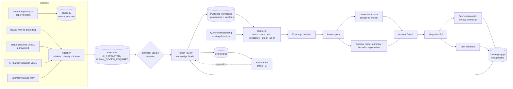

# Waymaker Knowledge Platform

> Waymaker answers from **verified, versioned, source-cited knowledge**, knows
> when it does not know, and turns what it does not know into a human-reviewed
> backlog. The model explains. It is not the database, not the authority and not
> the verifier of its own claims.

This document is the architecture reference for `backend/services/knowledge/`.
It extends — and does not replace — [`IMMIGRATION_INTELLIGENCE_ARCHITECTURE.md`](IMMIGRATION_INTELLIGENCE_ARCHITECTURE.md)
(evidence hierarchy, the RETRIEVAL_FAILED ≠ NO_RESULTS rule) and
[`ANSWER_QUALITY_CONTRACT.md`](ANSWER_QUALITY_CONTRACT.md) (the structured answer
contract from PR #641).

---

## 1. Canonical source of truth

**For Waymaker AI answers (`/api/ask`), the canonical production knowledge is the
PUBLISHED facts in the Knowledge Platform store, read only through
`services.knowledge` retrieval.** There is one answer.

| Artifact | Classification | Role after this change |
|---|---|---|
| Knowledge DB (`WAYMAKER_KNOWLEDGE_DB`, SQLite) | **canonical** | Published facts, provenance, review history, gaps, evals. |
| `backend/data/manual_grounding/stay_manual_grounding_2026_05.json` | legacy, human-verified | **Seed input only.** Imported at bootstrap as `legacy_repository_verified` facts. `/api/ask` no longer reads it (`_select_grounding` reads the store). Remove once the Studio-published set supersedes every seeded fact and the export is committed (§13). |
| `data/source_registry.json` + `data/manual_approval_index.json` | canonical for **manual edition identity / approval** | Mirrored into `sources` / `source_versions` (idempotent sync). Source monitoring workflows keep using the registry. |
| `data/status-guidance-202609.json` (from `scripts/status_guidance/author_rules.py`) | generated, **unreviewed** (2026.9) | Ingestion adapter input → review proposals. Still powers the front-end Quick Answer (not migrated in this PR — see §14). |
| `backend/data/manual_grounding/structured_requirements_2026_06_01.json` | derived | Prompt context + procedure packets (unchanged). Future ingestion adapter. |
| `visa_data.json` / `backend/data/visas.json` | generated (protected) | Catalog UI and supplemental prompt context (unchanged). |
| `backend/data/knowledge/eval_corpus_seed.json` | canonical (test data) | Reviewed-in-git regression corpus; imported idempotently. |
| `GET /api/knowledge/published` / `knowledge_cli.py export` | generated export | Portable snapshot of published knowledge; never edited by hand. |

---

## 2. Architecture



Module map (`backend/services/knowledge/`): `models` (vocabulary, boundary
schemas) · `store` (SQLite, migrations, transactions, audit) · `lifecycle`
(transition rules) · `repository` (the only writer) · `conflicts` · `review`
(queue, actions, transactional publish, impact) · `ingestion` · `adapters` ·
`diff` · `retrieval` · `understanding` · `coverage` · `guard` · `privacy` ·
`learning` · `evals` · `evidence` · `runtime` (facade) · `api` (HTTP).

---

## 3. Storage

Visable had **no database** in production (no Supabase/Postgres client exists;
`DATABASE_URL`/`SUPABASE_URL` are only reported as booleans). The platform uses
**stdlib SQLite** — no new dependency, no new service — with real relational
integrity: foreign keys, CHECK constraints for every enum, partial unique
indexes, and triggers. The schema (`migrations/0001_knowledge_foundation.sql`)
is written in the portable subset so a PostgreSQL port is mechanical.

Database-level invariants (enforced by triggers/constraints, not only Python):

* facts can only be **inserted as proposals** (`DRAFT` / `AI_EXTRACTED` / `HUMAN_REVIEW_REQUIRED`);
* AI-extractor output must enter as `AI_EXTRACTED`;
* lifecycle transitions are whitelisted (`lifecycle_transitions` table = `lifecycle.TRANSITIONS`, asserted by test);
* `PUBLISHED` requires ≥1 citation, a verifier, `verified_at`, `published_at`;
* `HUMAN_REVIEWED`/`VERIFIED` require a reviewer of kind `human_operator` or `legacy_repository_verification` — never an AI;
* reviewed content and its provenance are **immutable** (an edit is a new version);
* one published fact per slot and effective start (`uq_facts_published_slot`);
* the audit log is **append-only**;
* applied migrations are immutable (checksum).

Durability: `WAYMAKER_KNOWLEDGE_DB` (default `backend/var/knowledge/waymaker_knowledge.sqlite3`,
git-ignored). If the path cannot be opened the store falls back to in-memory,
re-seeds, keeps answering, and reports `durable=false` (the Studio shows a
banner). Railway's filesystem is ephemeral: **operator edits persist only with
a mounted volume** (§12).

---

## 4. Domain model

| Concept | Table / structure |
|---|---|
| source identity | `sources` (`source_key`, authority type, procedure family stay/visa/law, refresh state) |
| source version | `source_versions` (edition ref, version label, revision date, effective date **only if recorded**, sha256, artifact ref (internal), status active/staged/superseded/future_effective/withdrawn, content review state, lineage) |
| source sections | `source_sections` (page anchors for location validation) |
| source chunks / evidence | referenced, not copied: `data/manual-corpus/*.json` page text, legacy verified excerpt (`evidence.py`) |
| statuses, sub-codes, procedures, variants | `procedure_variants` (status, exact sub-code or parent-level with explicit `subcodes_covered`, procedure, stay/visa family, scenario) |
| requirements / documents / fees / deadlines / eligibility / online service / reporting / exceptions / notes | `knowledge_facts.property` + structured `value_json` + `condition_kind`/`condition_text` |
| fact versions | each `knowledge_facts` row is an immutable version; `lineage_id`, `version_no`, `supersedes_fact_id`, `superseded_by_fact_id` |
| citations / fact-source links | `fact_citations` (source version, section, pages, locator, excerpt, `locator_verified`, internal verification note) |
| review tasks / decisions | `review_tasks` (+ transparent `priority_factors`) and `audit_log` |
| conflicts | `knowledge_conflicts` |
| query observations, coverage gaps (= unknown queries), feedback | `query_observations`, `coverage_gaps`, `user_feedback` |
| evals | `eval_cases`, `eval_case_dependencies` (slot → case, impact analysis), `eval_runs`, `eval_results` |

Identity: `slot_key = variant_key | property | item_key`. `item_key` normalizes
annotations away (`'신청서 (별지 34호 서식)'` → `신청서`), so a wording change
between editions is CHANGED, not REMOVED + ADDED.

Canonical Korean source wording is the fact value; `display_translations` are
labelled non-authoritative.

---

## 5. Trust lifecycle

```
DRAFT ─┐
AI_EXTRACTED ─┴─> HUMAN_REVIEW_REQUIRED ─> HUMAN_REVIEWED ─> VERIFIED ─> PUBLISHED ─> SUPERSEDED
          any pre-publication state ─> REJECTED            PUBLISHED ─> WITHDRAWN
          HUMAN_REVIEWED / VERIFIED ─> HUMAN_REVIEW_REQUIRED  (sent back; prior review cleared)
```

* **AI-extracted ≠ verified.** Only `PUBLISHED` is authoritative for current answers.
* Reviewer kinds: `human_operator` (a named Knowledge Studio operator) and
  `legacy_repository_verification` — the pre-platform human page recheck the
  legacy grounding file records (`source_verification_status: verified_locally`).
  The legacy actor can only vouch for `legacy_repository_verified` facts; it can
  never review an extraction. Operators see the distinction in the Studio.
* **Transactional publish:** publishing supersedes the slot's current fact in the
  same transaction (or end-dates it for a future-effective successor). Tested
  with an injected failure: nothing changes on rollback.
* Temporal: `effective_from`/`effective_to` (NULL = unknown, never invented),
  `published_at`, `superseded_at`. Current queries return PUBLISHED facts in
  force today; `as_of` queries return what was in force then — by effective
  dates when known, otherwise by the knowledge window
  (`published_at … superseded_at`), reported as `temporal_basis`.

---

## 6. Source hierarchy

Reused, not redefined: `services.immigration_tools.AuthorityType` /
`AUTHORITY_RANK` (statute → approved manual → official guidance → consular →
administrative → precedent → structured data → unapproved extraction). A
weaker source can add context; a contradiction between sources is a recorded
conflict, never a silent override.

**Procedure scope** (CLAUDE.md): a stay procedure can only cite a stay-family
source and vice versa — rejected at ingestion (`PROCEDURE_SCOPE_MISMATCH`) and
again at publish.

---

## 7. Ingestion

```
knowledge_cli.py ingest --adapter status_guidance --status D-2 --dry-run   # preview
knowledge_cli.py ingest --adapter status_guidance --status D-2 --validate  # schema/refs only
knowledge_cli.py ingest --adapter status_guidance --status D-2 --apply     # -> review queue
knowledge_cli.py ingest --adapter extraction_json --file out.json --apply  # AI extraction contract
```

Every proposal is validated (pydantic + referential): known status/sub-code
(manual universe), sub-code belongs to status, known procedure, source version
exists and is not withdrawn, page within the edition, manual citations need a
page or locator, AI extractions must carry their evidence excerpt, no markup.
Then classified against existing knowledge: `add` / `update` (newer edition of
the same source vs the published fact) / `reconfirm` (same value, newer
edition) / `duplicate` / `conflict` / `invalid`. **Nothing is published by
ingestion.** Re-importing the same edition is a no-op (`proposal_hash` unique;
one open review task per fact).

Reference adapters: `source_registry`, `legacy_grounding` (seed),
`status_guidance` (2026.9), `extraction_json` (AI/parser output; origin forced
to `ai_extraction`, self-declared states stripped).

---

## 8. Conflicts, diff, impact

* **Conflict** = same slot, different value, and not a newer-edition update:
  same edition disagreeing, older edition contradicting, different sources,
  overlapping effective windows. Recorded with both provenances; blocks
  approval/publish of either side until an operator resolves it (keep A/B or
  dismiss, reason required). A conflict reaches **public** coverage
  (`CONFLICTING_SOURCES`) only when every side carries a human judgement;
  unreviewed AI/parser proposals are operator signals only. The structured
  answer then moves the disputed items to "확인이 필요한 서류" with a notice —
  never picks a side.
* **Source diff** (`diff.py`, Studio → 출처·버전, CLI `diff`): ADDED / REMOVED /
  CHANGED (named fields: `requirement_level`, `condition`, `wording`) /
  UNCHANGED, per slot, with affected eval cases. Deterministic; no model.
  Real result for D-2 2026.6 → 2026.9: 재정입증 서류 becomes conditional,
  수료증명서 loses its (해당자) condition, two wording-only changes, four unchanged.
* **Impact** (review screen): affected eval cases (via `eval_case_dependencies`),
  the fact that would be superseded, whether a regression re-run is needed.

---

## 9. Runtime integration (`/api/ask`)

```
question → _detect_visa_codes / _detect_task_type (existing, reused)
        → understanding (intent facets, missing decisive facts, ambiguity)
        → retrieval (published facts only) → coverage decision → answer plan
        → structured facts (unchanged PR #641 renderer) → optional model summary
        → Answer Guard → public projection → UI
        → observation / gap (privacy-minimized) + opaque answer_ref
```

* `_select_grounding` keeps its contract (dict shape, sub-code rules) but reads
  the store; a parity test asserts equality with the legacy entries, and the
  committed D-2 browser fixtures are byte-identical except the new `answer_ref`.
* Structured entries carry the reviewed requirement level, so a published
  "conditional" fact can never be re-bucketed as universal from its wording.
* `knowledge_plan` (understanding, coverage, retrieval ids, guard) is
  **diagnostics-only** (removed by `_public_ask_payload`).
* Outage: when every model candidate fails, the verified checklist is served
  from the store (200, `deterministic_fallback_answer_used`). "No provider
  configured" remains a 503 operator signal (existing contract).
* The detector no longer misses codes glued to Korean ("D-2비자").

### Coverage states

| State | When | Path | Knowledge gap? |
|---|---|---|---|
| DIRECT_VERIFIED | published facts answer the intent, no conditions | deterministic structured | no |
| VERIFIED_WITH_CONDITIONS | … with conditional items or sub-code-scoped list | deterministic + conditions | no |
| PARTIAL_VERIFIED | verified facts, but the asked property (fee, …) is missing, or a procedural explanation | verified facts + bounded synthesis | only if a property is missing |
| NEEDS_CLARIFICATION | decisive **user** fact missing (status, multiple statuses) | ask for it | **no** (user-fact gap) |
| CONFLICTING_SOURCES | human-backed conflict in the slot | explain conflict | SOURCE_CONFLICT |
| OUTDATED_SOURCE | cited edition withdrawn | limited guidance | SOURCE_OUTDATED |
| NO_DIRECT_SOURCE | no published facts / uncovered sub-code / high-risk task | limited guidance (existing pipeline) | NO_VERIFIED_KNOWLEDGE / UNKNOWN_SUBCODE |
| UNKNOWN | retrieval failed; code outside the manual universe | safe fallback | RETRIEVAL_FAILED / UNKNOWN_STATUS |
| OUT_OF_SCOPE | case research / general explanation | existing pipeline | no |

A superseded manual edition cited by published facts is **not** a public
downgrade: the source is marked `refresh_due` for operators (today: the 2026.6
stay-manual facts while 2026.7 is the approved edition and 2026.9 is staged).

### Answer Guard (`guard.py`)

Critical (text withheld; deterministic answer shown): provider/model leak,
internal metadata leak, unsafe HTML, unsupported document (vs verified facts,
doc_master vocabulary), guaranteed-outcome certainty. High (model summary
dropped on structured answers): conditional promoted to universal, wrong status
family, stay/visa procedure mixing, unsupported page citation, claimed official
confirmation, required fact omitted (full answers). Medium/low: language
mismatch, duplicated disclaimers. Free-form leak-only findings scrub the
leaking lines first (as #641's metadata scrub does) and withhold only if nothing
substantive remains. Streaming answers are not guarded pre-display (the
existing post-stream safety review applies) — a known limitation.

---

## 10. Continuous learning loop (no weight updates)

```
query → observation (features + sanitized excerpt) → coverage decision
      → gap (dedupe key status|sub-code|procedure|intent|reason) / feedback
      → Studio review → knowledge added/corrected → gap resolved
      → promote to eval (draft) → human approves → CI runs it forever
```

* **Knowledge gap ≠ user-fact gap**: clarification questions are observed but
  never queued as gaps.
* **No self-training**: observations, answers and feedback never create facts;
  facts need an external source citation. Tested.
* A resolved gap that recurs reopens automatically.
* Feedback reasons: INCORRECT, MISSING_INFORMATION, OUTDATED, SOURCE_PROBLEM,
  MISUNDERSTOOD_QUESTION, HARD_TO_UNDERSTAND, TOO_LONG, HELPFUL — the first four
  feed the gap queue. The answer card offers fixed reasons only (no free text).
* Review priority is transparent (stored factors): gap frequency, feedback,
  procedure risk, source authority, affected evals, open conflicts, age,
  update-of-published.
* Fine-tuning is **not** implemented. A future training candidate may come only
  from reviewed, anonymized, approved eval cases.

---

## 11. Evaluation

* Persistent corpus: 19 seed cases (`eval_corpus_seed.json`: D-2 ko/en and
  glued-particle, D-4 scope, D-4-2K / E-7-4 never inherit the parent, E-7, F-6 /
  G-1 / F-1 online-eligibility gaps, status change, workplace change, reentry,
  missing status → clarify, synthetic unknown (H-2), F-6 divorce never gets a
  checklist, case research, fee partial, PII in question) + the 50 golden
  routing questions (referenced, same payload semantics as the legacy runner).
* Assertions: MUST_INCLUDE_FACT, MUST_NOT_INCLUDE_FACT, EXPECTED_BUCKET,
  SOURCE_MUST_BE / MUST_NOT_BE, EXPECTED_STATUS / SUBCODE / PROCEDURE / INTENT /
  COVERAGE_STATE, MUST_CLARIFY / MUST_NOT_CLARIFY, MUST_RECORD_GAP /
  MUST_NOT_RECORD_GAP, MUST_NOT_CLAIM_CERTAINTY, MUST_NOT_LEAK_INTERNAL_METADATA,
  MUST_NOT_LEAK_MODEL_PROVIDER, LANGUAGE_EXPECTED. Facts, not prose.
* Runner: one case / `tag:<t>` / all; JSON and text reports; runs persisted.
* CI: `scripts/check_repo.sh` step 14b runs every approved case offline and
  strictly (in-memory store, no network, no model). Live-model checks stay in
  the existing smoke scripts and are not part of PR CI.

---

## 12. Operator workflow and deployment

Knowledge Studio: `knowledge-studio.html` (noindex; holds no data). Views:
overview (what to review next, metrics, refresh warnings), review queue
(proposed vs current diff, provenance, evidence excerpt, impact, audit;
approve / verify / publish / reject / needs evidence / edit — reasons required
for publish and reject), knowledge (+ manual entry), conflicts, sources &
versions (+ diff, + import with dry-run), coverage gaps, unknown queries
(+ promote to eval), evals (run, approve drafts), audit log.

Required environment (backend):

| Variable | Purpose |
|---|---|
| `WAYMAKER_OPERATOR_TOKENS` | `name:token,…` (token ≥ 16 chars). Unset ⇒ Studio API answers 503 (closed). |
| `WAYMAKER_KNOWLEDGE_DB` | DB path; **must be on a Railway volume** for operator edits to survive redeploys. |
| `WAYMAKER_QUERY_TEXT_RETENTION` | `sanitized` (default) or `none`. |
| `WAYMAKER_OBSERVATION_RETENTION_DAYS` | default 90; purge with `knowledge_cli.py purge-observations`. |
| `WAYMAKER_KNOWLEDGE_OBSERVATIONS` | `0` disables observation recording. |

Production rollout (operator steps — **not performed by this PR**):
1. Mount a Railway volume (e.g. `/data`) and set `WAYMAKER_KNOWLEDGE_DB=/data/waymaker_knowledge.sqlite3`.
2. Set `WAYMAKER_OPERATOR_TOKENS` from a secret store.
3. Deploy. Migration `0001` and the idempotent seed run on first request; nothing destructive exists.
4. Smoke: `POST /api/ask {"question":"D-2 연장시 필수 서류"}` (structured checklist, `answer_ref` present);
   `POST /api/ask {"question":"H-2 체류기간 연장 필요 서류"}` then Studio → 미지 질문 shows the gap;
   `GET /api/knowledge/studio/overview` without a token → 401.

---

## 13. Migration strategy

1. **Done here:** legacy verified grounding → seeded published facts; `/api/ask`
   reads the store through the legacy-shaped adapter; parity + fixture tests.
2. Operators review the 2026.9 proposals (already classified add / update /
   reconfirm) and the 2026.7 approved edition; publishing supersedes the
   2026.6-cited facts with lineage kept.
3. Export (`knowledge_cli.py export`) and commit the published snapshot; switch
   the seed from the legacy file to the export; then retire
   `stay_manual_grounding_2026_05.json` (its human-review record stays in
   `audit_log` and git history).
4. Migrate the front-end Quick Answer from `status-guidance-202609.json` to
   `GET /api/knowledge/published` (or a generated snapshot of it) so the 2026.9
   unreviewed layer stops being a second, unreviewed truth.

---

## 14. Security, privacy and data boundaries

| Boundary | What may cross |
|---|---|
| public browser → backend | question, lang, `answer_ref` + fixed feedback reason |
| backend → public browser | public projection: facts, conditions, citation (title, edition, issuing body, section, pages), uncertainty; **no** ids, states, review data, file paths, provider/model |
| backend ↔ knowledge DB | everything (server-side only) |
| operator (authenticated) ↔ backend | review metadata, provenance, sanitized examples, audit |
| backend → AI provider | the question and the verified evidence prompt (unchanged); never review data, observations or operator identities |
| logs | stable event names (`knowledge_bootstrap`, `knowledge_ingestion_run`, `knowledge_review_action`, `knowledge_coverage_decision`, `knowledge_gap_created`, `knowledge_answer_guard`, `knowledge_eval_run`, `knowledge_feedback_recorded`) with codes and counts — no question text |

Privacy: observations keep features plus a ≤200-char excerpt redacted by the
Trust & Safety redactor (passport, ARC/RRN, phone, email, long numbers,
addresses) plus names, health markers, amounts and account numbers; retention
bounded and purgeable; text retention can be turned off. Feedback has no free
text in the UI; API comments are sanitized and capped. Anonymous users can
submit feedback (rate-limited) and read the published export; every mutation
(review, publish, ingest, eval edits, gap resolution, source state) requires an
operator token, and every mutation is audited (who, what, when, before, after,
reason).
