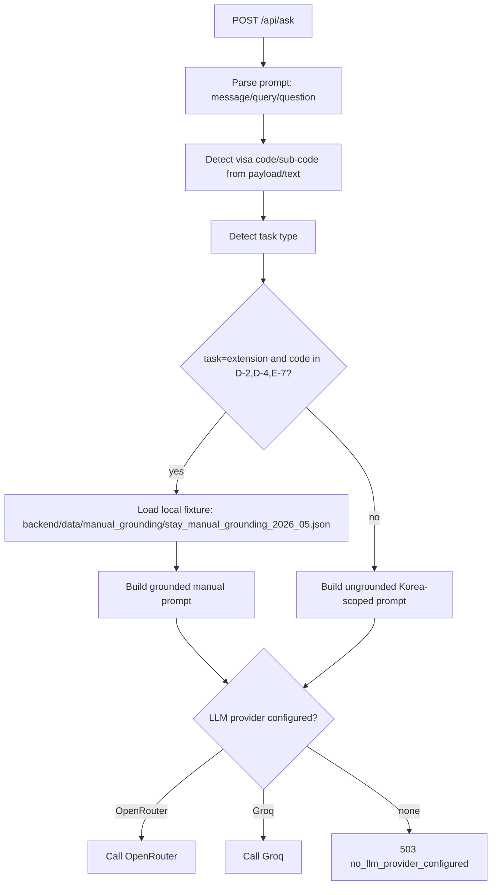

# PUBLIC_DATA_AND_LAW_GROUNDING_AUDIT

Date: 2026-05-19  
Repository: `lucanomics/Paradiso`  
Scope: current branch runtime audit + design-only proposal (no production API wiring)

## Executive verdict

**Current public-data/law API integration is `declared only` (runtime inactive).**

- `LAW_API_KEY`, `DATABASE_URL`, `SUPABASE_URL`, `SUPABASE_SERVICE_KEY` are declared in backend env/config surfaces.
- Current runtime code does not call public-data APIs, National Law Information APIs, Supabase, or database services.
- `/api/ask` grounding is currently deterministic fixture-based for a narrow subset only (manual JSON fixture), with LLM synthesis.

---

## Evidence table (declared vs active runtime use)

| Env var | Declared in repo | Used in runtime logic | Endpoint affected | Current behavior |
|---|---|---|---|---|
| `LAW_API_KEY` | Yes (`backend/.env.example`, `backend/paradiso_backend.py`) | **Only presence flag** in `/health` provider map; no API client call | `/health` | Reports boolean configured/unconfigured; no connectivity check |
| `DATABASE_URL` | Yes | **Only presence flag** in `/health` provider map; no DB query path | `/health` | Reports boolean only |
| `SUPABASE_URL` | Yes | Combined presence flag with `SUPABASE_SERVICE_KEY`; no Supabase call path | `/health` | Reports boolean only |
| `SUPABASE_SERVICE_KEY` | Yes | Combined presence flag with `SUPABASE_URL`; no Supabase call path | `/health` | Reports boolean only |
| `PUBLIC_DATA_KEY` | Not declared in current backend env file (`backend/.env.example`) | Not referenced in current backend runtime | None | No public-data integration path |
| `PUBLIC_DATA_API_KEY` | Not currently declared (recommended placeholder in this PR) | Not referenced in current backend runtime | None | No public-data integration path |

---

## Runtime endpoint audit

### `/api/ask` grounding flow (current)



**Findings**
- `/api/ask` does **not** call any public-data API today.
- `/api/ask` does **not** call National Law Information / 법제처 API today.
- `/api/ask` does **not** call Supabase RAG today.
- Grounding path is local fixture matching + prompt shaping, not external retrieval.

### `/api/visas` data source behavior (current)

Source order:
1. `VISA_DATA_PATH` explicit file path (env)
2. `backend/data/visas.json`
3. repo-root `visa_data.json`
4. fallback `DEFAULT_VISAS` in code

**Finding:** `/api/visas` currently uses local JSON/fallback only. It does not use public-data APIs or DB/Supabase.

### `/health` provider flag limitations

`/health` returns `providers` booleans based on env presence only:
- `law_api`: `bool(LAW_API_KEY)`
- `database`: `bool(DATABASE_URL)`
- `supabase`: `bool(SUPABASE_URL and SUPABASE_SERVICE_KEY)`

**Limitation:** this is configuration presence telemetry, not actual upstream connectivity, credential validity, schema integrity, or query capability.

---

## Grounding-mode classification (current state)

- **Static fixture-based grounding:** active (narrow scope)
- **RAG-based grounding (vector retrieval):** inactive
- **External public-data API grounding:** inactive
- **External legal API grounding (법제처/국가법령정보):** inactive
- **Overall mode:** mixed prompt pipeline, but external grounding providers inactive

### Visa/task combinations actually grounded today

Grounded only when:
- `task_type_detected == extension`
- top visa code in `{D-2, D-4, E-7}`
- and matching entry exists in local fixture

All other combinations (including F-6 divorce scenarios and law-basis requests) run ungrounded Korea-scoped response instructions.

---

## Gap list

1. **Public-data API not actually called** in current runtime.
2. **Law API (National Law Information/법제처) not actually called** in current runtime.
3. **Supabase RAG not active** in current runtime.
4. **Grounding is fixture-only in narrow scope** (`D-2/D-4/E-7` extension path).

---

## Recommended smoke tests and expected outputs

### 1) `GET /health`
- Expect `200` with `status: "ok"` and `providers` booleans.
- Do **not** interpret `providers.* == true` as connectivity guarantee.

### 2) `GET /api/visas`
- Expect `200` with keys: `count`, `data`, `visas`, `source`, `source_type`.
- Expect local source label (`backend-data` or `repo-root`) unless fallback path is used.

### 3) `POST /api/ask` with D-2 extension question
Example payload:
```json
{"question":"D-2 비자 연장에 필요한 서류는?","visa_code":"D-2","lang":"ko"}
```
Expected:
- `200` (if OpenRouter/Groq configured) or `503` no provider configured.
- `grounding_used: true`
- `task_type_detected: "extension"`
- `visa_code_detected: "D-2"`
- `grounding_sources` populated from manual fixture metadata.

### 4) `POST /api/ask` with F-6 divorce
Example payload:
```json
{"question":"F-6-1 상태에서 이혼하면 어떻게 되나요?","visa_code":"F-6-1","lang":"ko"}
```
Expected:
- `200` or `503` (provider-dependent)
- `grounding_used: false`
- `task_type_detected: "marriage_divorce_status_change"`
- ungrounded Korea-scoped guidance (risk-aware), no legal/public-data API citations.

### 5) `POST /api/ask` asking legal basis under 출입국관리법
Example payload:
```json
{"question":"출입국관리법 근거 조문 기준으로 D-2 연장 근거를 알려줘"}
```
Expected:
- No live law API retrieval in current backend.
- Response is either grounded manual-only (if extension + grounded code detected) or ungrounded scoped guidance.
- No structured law-API source object from external legal provider.

---

## Paradiso-native legal/public-data grounding design

Design goals:
- Keep **Paradiso-specific** implementation and contracts.
- Use official source hierarchy and explicit verification markers.
- Degrade safely under API failure without hallucinated legal citations.

### Source hierarchy (authoritative order)

1. Official visa/stay manuals and verified manual fixtures
2. HiKorea / immigration office execution flows
3. Public-data API structured datasets
4. National Law Information / 법제처 legal text
5. LLM reasoning only for formatting/synthesis

### Proposed modules

- `backend/services/public_data_client.py`
  - public dataset fetch/normalize/cache
  - typed result envelope with source timestamp/endpoint
- `backend/services/korean_law_client.py`
  - legal text search + article fetch + metadata normalization
  - upstream timeout/retry budget (short)
- `backend/services/citation_verifier.py`
  - verify cited article numbers/titles against fetched payload
  - reject unverifiable citations
- `backend/services/law_grounding.py`
  - orchestrate retrieval chain and merge legal/public/manual evidence
  - apply failure markers + fallback policy
- `backend/services/source_priority.py`
  - deterministic ranking/selection logic by source hierarchy
  - tie-breaking by recency, issuer trust, verification status

### Proposed response contract

```json
{
  "grounding_used": true,
  "grounding_sources": [],
  "law_grounding": [],
  "public_data_grounding": [],
  "manual_grounding": [],
  "grounding_warnings": []
}
```

### Failure markers

- `NOT_FOUND`
- `SOURCE_UNAVAILABLE`
- `CITATION_VERIFICATION_FAILED`
- `STALE_SOURCE_WARNING`

### Cache policy (proposal)

- Law search result TTL: **1 hour**
- Law article text TTL: **24 hours**
- Public-data structured dataset TTL: **6–24 hours by dataset volatility**

### Timeout / graceful degradation policy

- Each external API call should use a short timeout (e.g., 5–8s hard timeout).
- If law/public-data lookup fails:
  - continue with available manual grounding if present,
  - emit `grounding_warnings` with specific failure marker,
  - never claim verified legal citation unless citation verifier passes.

---

## Reuse boundary and plagiarism/license risk

### License and legal reuse posture

- `korean-law-mcp` repository appears MIT licensed (confirmed by repository license indicator and LICENSE metadata).
- MIT generally permits use/copy/modify/distribute with copyright + license notice.

### Recommended Paradiso approach

- Treat `korean-law-mcp` as **conceptual inspiration only** for architecture patterns.
- Build Paradiso-native Python service clients, error envelopes, and response contracts.
- If conceptual ideas are influenced (e.g., citation verification, NOT_FOUND marker style, timeout/fallback/cache framing), document attribution in Paradiso docs.

### Prohibited in this PR

- Copying files from `korean-law-mcp`
- Copying function bodies
- Copying prompts/tool descriptions
- Copying README text
- Copying folder structure
- Adding `korean-law-mcp` as a production dependency

### Allowed

- Reading the repo for architecture reference
- Summarizing high-level patterns
- Borrowing conceptual ideas (citation verification, timeout/fallback design, cache strategy, not-found markers) with attribution

### Attribution note (this audit)

This document references `korean-law-mcp` only at architectural-concept level and intentionally avoids code/content reuse.

---

## Phase 1 implementation status (2026-05-19)

Phase 1 scaffold adapters were added under `backend/services/`:
- `grounding_config.py`
- `public_data_client.py`
- `korean_law_client.py`
- `citation_verifier.py`
- `law_grounding.py`

Status and guarantees:
- Disabled by default via `LAW_GROUNDING_MODE=disabled`.
- No production public-data or law API calls are executed by default.
- Adapters are not wired into `/api/ask` yet.
- Existing `/api/ask` behavior remains unchanged in production.
- No `korean-law-mcp` dependency added and no source copied.

Recommended Phase 2:
- Implement real law/public-data HTTP calls in `audit` mode only first,
  with short timeouts and structured warning markers for graceful degradation.

## Phase 2 audit-mode HTTP clients (2026-05-19)

Implemented in `backend/services/`:
- `korean_law_client.py` now includes audit-mode HTTP methods for `search_law` and `get_article`.
- `public_data_client.py` now includes audit-mode HTTP methods for visa/job public-data fetches.
- `grounding_config.py` now supports optional endpoint env configuration:
  - `LAW_API_BASE_URL`, `LAW_API_SEARCH_PATH`, `LAW_API_ARTICLE_PATH`
  - `PUBLIC_DATA_BASE_URL`, `PUBLIC_DATA_VISA_PATH`, `PUBLIC_DATA_JOB_PATH`

Safety posture:
- Default mode is still `LAW_GROUNDING_MODE=disabled`.
- No external calls occur in disabled mode.
- `/api/ask` is still not wired to these clients.
- Error handling is structured with warning markers (timeout/http/parse/unavailable).
- API keys are not echoed in result payloads or warnings.

Testing posture:
- Mock-based tests cover audit-mode success/error paths without live external API access.
- Live endpoint validation is deferred and requires real keys plus controlled smoke testing.

Reuse boundary:
- No `korean-law-mcp` dependency added.
- No source code copied from `korean-law-mcp`.

## Phase 3 citation verification + debug endpoint (2026-05-19)

- Added citation verification on top of conservative citation extraction in `backend/services/citation_verifier.py`.
- Added debug-only inspection endpoint: `POST /api/debug/law-grounding`.
- Default behavior remains disabled (`LAW_GROUNDING_MODE=disabled`).
- Still not wired to `/api/ask`; normal production chatbot flow is unchanged.
- Debug endpoint is inspection-only for development/testing, not public legal advice.
- Tests are mock-based (no live external API calls required for coverage).
- Reuse boundary preserved:
  - no `korean-law-mcp` dependency added
  - no `korean-law-mcp` source copied
